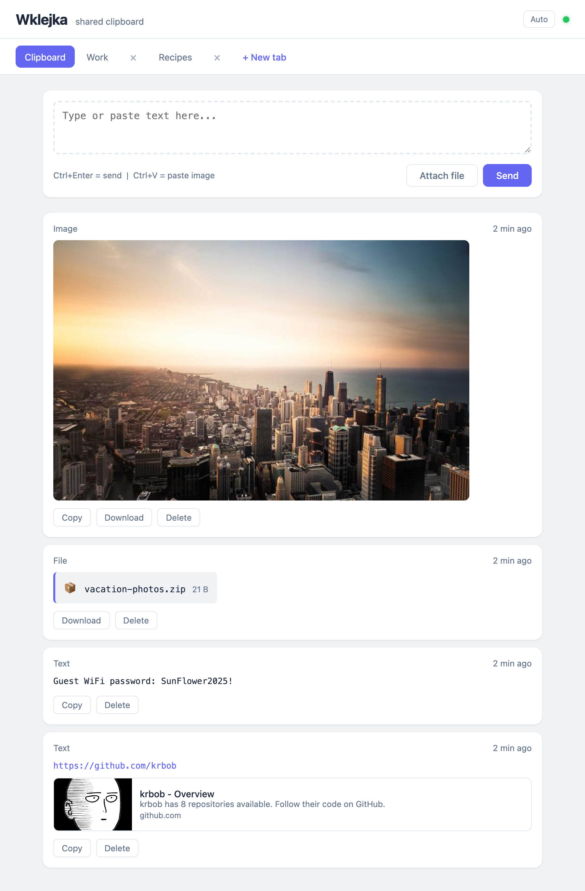

# wklejka


Lightweight, browser-based shared clipboard. Paste text or an image on one computer and instantly pick it up on another. Real-time sync via WebSocket, no sign-up required.



## Getting started

1. Make sure Docker is installed.
2. Run the container: `docker run --rm -p 3000:3000 -v ./data:/app/data ghcr.io/krbob/wklejka:latest`.
3. Open `http://localhost:3000` in a browser (from another machine: `http://<IP>:3000`).

Alternatively with `docker compose`:

```bash
git clone https://github.com/krbob/wklejka.git
cd wklejka
docker compose up -d
```

## Features

- **Text & images** – paste (Ctrl+V) or drag and drop.
- **Real-time sync** – WebSocket instantly propagates changes to every open browser.
- **Tabs** – separate virtual documents (e.g. "Work", "Home").
- **Copy / Download / Delete** – on every entry.
- **Persistent storage** – data lives in the `data/` directory (JSON + image files) and survives container restarts.
- **Multilingual** – UI automatically switches between Polish and English based on browser language.

## UI language

Language is detected automatically from `navigator.language`. You can override it with a URL parameter:

- `http://localhost:3000?lang=pl` – Polish
- `http://localhost:3000?lang=en` – English
