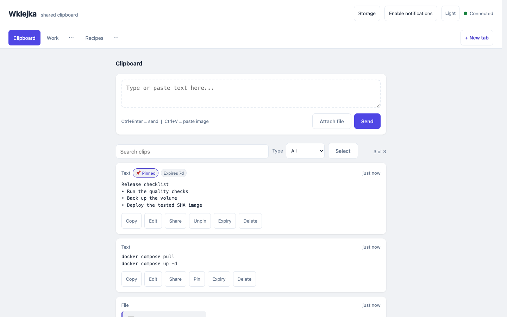

# wklejka

[](https://github.com/krbob/wklejka/actions/workflows/ci.yml)

Lightweight, self-hosted clipboard for moving text, images, and files between your devices. Wklejka has no accounts or cloud dependency: one Node.js process serves the UI and API, persists data on disk, and synchronizes open browsers over WebSocket.

<picture>
  <source media="(prefers-color-scheme: dark)" srcset="screenshot-dark.png">
  
</picture>

## Security model

Clipboard contents are often sensitive. Wklejka is intended for a trusted household or small team and is not a multi-tenant service. Keep the application behind a firewall, enable authentication, and use HTTPS whenever another device connects.

Plain HTTP is suitable only for `localhost`. Browsers restrict clipboard access, notifications, and service workers on an insecure LAN origin such as `http://192.168.1.20:3000`. See [secure deployment](docs/deployment.md) before exposing Wklejka beyond the local machine.

## Quick start on one machine

Create `docker-compose.yml`:

```yaml
services:
  wklejka:
    image: ghcr.io/krbob/wklejka:latest
    ports:
      - "127.0.0.1:3000:3000"
    volumes:
      - wklejka-data:/app/data
    init: true
    read_only: true
    tmpfs:
      - /tmp:rw,noexec,nosuid,size=16m,mode=1777
    cap_drop:
      - ALL
    security_opt:
      - no-new-privileges:true
    pids_limit: 100
    stop_grace_period: 10s
    restart: unless-stopped

volumes:
  wklejka-data:
    name: wklejka-data
```

Start the service and open <http://localhost:3000>:

```bash
docker compose up -d
```

The loopback port binding deliberately prevents other hosts from reaching the unencrypted service. For phone/tablet access, put it behind an HTTPS reverse proxy rather than changing the binding to `0.0.0.0`.

The equivalent one-off command is:

```bash
docker run --rm \
  -p 127.0.0.1:3000:3000 \
  -v wklejka-data:/app/data \
  ghcr.io/krbob/wklejka:latest
```

For a bind mount such as `./data:/app/data`, make the directory writable by UID/GID `1000` used by the container.

## Features

- Text, image, and file clips with paste, drag-and-drop, and streaming uploads up to 100 MB by default.
- Real-time synchronization over an origin-checked WebSocket that shares the application's authentication policy.
- Separate boards with rename, reorder, lock, expiry, search/type filters, direct clip links, and locally generated QR sharing.
- Pinned and expiring clips, cursor pagination, bulk deletion, and configurable retention.
- Copy, download, edit, delete, inline media previews, and lightweight syntax highlighting.
- Responsive Polish/English interface, dark mode, accessible dialogs, status feedback, and keyboard navigation.
- Write-before-ack metadata snapshots, recovery backup, maintenance dry-runs, and orphan cleanup.
- Rate limits, strict request validation, safe download headers, and SSRF protection plus bounded caching for link previews.
- Auth-protected status, Prometheus metrics, and metadata export endpoints for operators.

## Configuration

Common settings:

| Variable | Default | Purpose |
| --- | ---: | --- |
| `MAX_CLIP_BINARY_BYTES` | `104857600` | Maximum size of one image or file. |
| `MAX_TEXT_CLIP_BYTES` | `1048576` | Maximum UTF-8 size of one text clip. |
| `MAX_STORAGE_BYTES` | `5368709120` | Aggregate quota for referenced file and image bodies. |
| `MAX_BOARDS` | `100` | Maximum number of boards. |
| `MAX_TOTAL_CLIPS` | `50000` | Maximum number of clips across all boards. |
| `DEFAULT_CLIPS_PAGE_SIZE` | `50` | Default number of clips in a paginated response. |
| `CLIP_RETENTION_MS` | `0` (disabled) | Age after which unpinned clips are removed. |
| `AUTH_USERNAME`, `AUTH_PASSWORD` | unset | Enable HTTP Basic authentication when both are set. |
| `AUTH_TOKEN` | unset | Enable bearer/cookie token authentication. |
| `PUBLIC_ORIGIN` | inferred | Exact public origin allowed to open `/ws`, for example `https://clipboard.example.net`. |
| `TRUST_PROXY` | disabled | Trusted reverse-proxy hop count or range; commonly `1`. |

Application quotas complement rather than replace filesystem monitoring: metadata, recovery copies, and filesystem overhead also consume space. The complete environment reference, capacity guidance, and data layout are in [operations](docs/operations.md).

## Documentation

- [Secure HTTPS/WSS deployment and authentication](docs/deployment.md)
- [Configuration, quotas, backup, and restore](docs/operations.md)
- [Architecture and scaling boundaries](docs/architecture.md)
- [Security policy](SECURITY.md)

## Development

Node.js 24 and npm 11 are the supported development baseline.

```bash
nvm use
npm ci
npm run check
npm start
```

`npm run check` runs ESLint, JavaScript type checks, tests, and coverage thresholds. The service listens on <http://localhost:3000> by default; use a temporary `DATA_DIR` for manual experiments when you do not want to touch the normal data directory.

## UI language

The UI follows `navigator.languages` and falls back to `navigator.language`. Override it with `?lang=pl` or `?lang=en`.

## License

[MIT](LICENSE)
